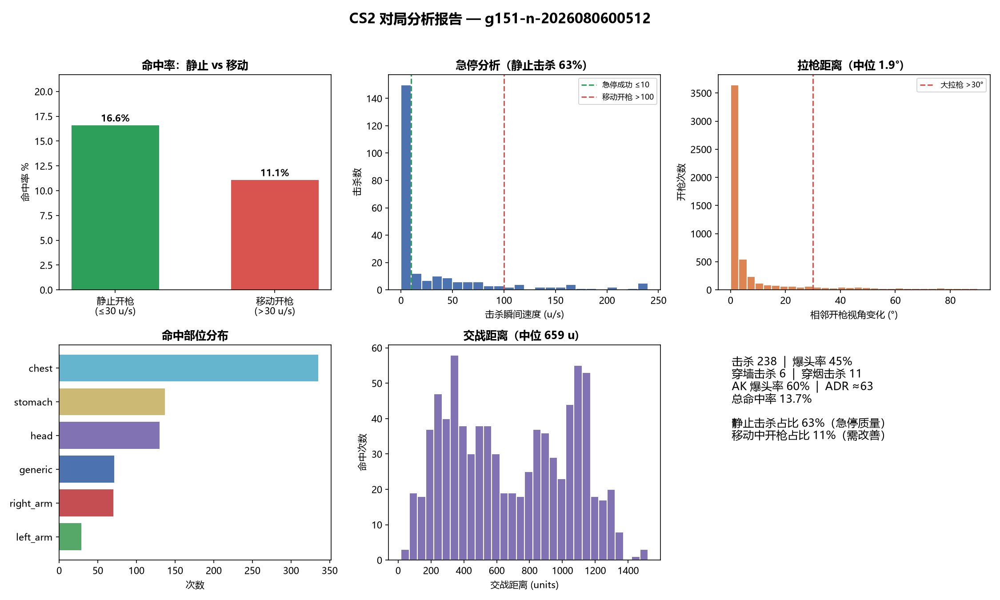

# CS2Analyzer — CS2 对局数据分析工具

基于官方 demo 文件解析的 **Counter-Strike 2 对局/练枪数据分析工具**。
零风险（不碰游戏进程）、100% 精确（官方数据）、无实时性压力（练完 6 秒出报告）。

## 功能

对任意 CS2 demo（`.dem`）输出完整对局分析：

| 维度 | 指标 |
|---|---|
| **急停** | 每击杀瞬间的开枪速度：静止击杀占比（急停成功）vs 移动中开枪占比（急停失败） |
| **命中率** | 总命中率 + **静止 vs 移动分桶命中率**（急停价值的直接证据） |
| **拉枪** | 相邻开枪的视角变化：平均/中位/大角度拉枪占比 |
| **命中部位** | head/chest/stomach 分布（瞄头还是瞄身体） |
| **交战距离** | 平均/中位距离、远距离与贴脸占比 |
| **效率** | ADR（每回合均伤）、爆头率（按武器）、穿墙/穿烟击杀 |
| **数据导出** | 每枪 / 每次命中 / 每击杀 三张 CSV，可二次分析 |

## 报告示例

```powershell
# 先跑分析，再出图（读 output/ 下 CSV 生成综合报告）
python scripts\analyze_full.py <demo路径>
python scripts\plot_report.py <demo名> docs\report_example.png
```



## 快速开始

```powershell
# 安装依赖（Python 3.10+）
pip install -r requirements.txt

# 分析任意 demo
python scripts\analyze_full.py <demo路径> [输出目录]

# 快速击杀+急停分析
python scripts\analyze_kills.py <demo路径>
```

输出示例（5E de_dust2 对局，46 回合）：
```
[命中率] 总 16.7% (821/4915)
  静止(≤30u/s): 2672 枪 | 命中 470 → 17.6% 命中率
  移动(>30u/s): 2243 枪 | 命中 351 → 15.6% 命中率
[急停] 静止击杀(≤10u/s): 150 (63%) | 移动开枪(>100u/s): 26 (11%)
[拉枪] 平均 16.9° | 中位 1.9° | >30°: 17% | >60°: 11%
[命中部位] head:130 (16%) | chest:335, stomach:137
[击杀] 爆头率 45% | 穿墙 6 | 穿烟 11 | AK 爆头率 60%
```

## 完整使用流程（分步）

### 第 1 步：环境准备

```powershell
# 需要 Python 3.10+（python --version 检查）
cd CS2Analyzer
pip install -r requirements.txt
```

### 第 2 步：录制 demo

进游戏，控制台（`~` 键）输入：

```
record 训练1        # 开始录制（练枪图 / 比赛 / 死斗都行）
stop               # 打完后停止
```

demo 文件自动生成在：`Steam\steamapps\common\Counter-Strike Global Offensive\game\csgo\`
（Steam 库可能不在 C 盘，用 Steam 客户端"设置→存储"查看库位置）

### 第 3 步：放置 demo

把 `.dem` 文件复制到项目 `demos\` 文件夹（也可以放任意路径，后面指定就行）：

```powershell
Copy-Item "E:\SteamLibrary\...\csgo\训练1.dem" E:\CS2Analyzer\demos\
```

### 第 4 步：运行分析

```powershell
# 参数1: demo 文件路径（必填）  参数2: 输出目录（可选，默认 output\）
python scripts\analyze_full.py demos\训练1.dem
```

终端会打印完整汇总（命中率/急停/拉枪/部位/距离/ADR/爆头率），同时生成三张 CSV。

### 第 5 步：查看结果

`output\` 目录下三个文件（文件名 = demo 名 + 后缀）：

| 文件 | 内容 | 每行含义 |
|---|---|---|
| `xxx_shots.csv` | 每枪记录 | 开枪时刻、玩家、武器、开枪速度、拉枪角度 |
| `xxx_hits.csv` | 每次命中 | 攻击者、受害者、武器、命中部位、伤害、距离 |
| `xxx_kills.csv` | 每击杀 | 击杀者、武器、爆头/穿墙/穿烟标记、击杀瞬间速度 |

用 Excel / VS Code / pandas 都能打开（UTF-8 编码）。

### 第 6 步：生成报告图（可选）

```powershell
python scripts\plot_report.py 训练1        # demo 名（不含路径和 .dem）
# 或指定输出位置:
python scripts\plot_report.py 训练1 docs\my_report.png
```

### 其他命令

```powershell
# 只看击杀+急停的快速版
python scripts\analyze_kills.py demos\训练1.dem

# 探测任意 demo 能读出什么（验证数据源）
python scripts\probe_demo.py demos\训练1.dem
```

## 常见问题（FAQ）

| 问题 | 解决 |
|---|---|
| `ModuleNotFoundError: demoparser2` | 没装依赖：`pip install -r requirements.txt` |
| 找不到 demo 文件 | 在 Steam 客户端查库路径（设置→存储），demo 在 `game\csgo\` 下 |
| 终端中文乱码 | PowerShell 先执行 `chcp 65001`，或用 VS Code 终端 |
| 路径含空格报错 | 路径加引号：`python scripts\analyze_full.py "demos\my file.dem"` |
| 5E 平台 demo 提示"回退 player_hurt" | 正常现象，5E demo 缺子弹级事件，已自动降级处理 |
| 分析很慢（>1 分钟） | 正常，demo 越大越慢；337MB 约 6 秒，超长比赛可能 30 秒+ |

## 目录结构

```
CS2Analyzer/
├── demos/          # 放 .dem 文件（不入库）
├── output/         # 分析结果 CSV（不入库）
├── scripts/
│   ├── analyze_full.py    # 全量分析（主入口）
│   ├── analyze_kills.py   # 击杀+急停快速分析
│   ├── probe_demo.py      # 字段探测（验证任意 demo 能读出什么）
│   └── debug/             # 数据质量校准脚本（shoot_ang 坐标系验证等）
└── docs/
    └── cs2-fields-and-pitfalls.md  # 字段清单与踩坑记录
```

## 技术要点（全部实测）

- 数据源：`demoparser2`（Rust 核心，337MB demo 全量解析约 6 秒）
- 位置字段：`CCSPlayerPawn.CBodyComponentBaseAnimGraph.m_vecX/Y/Z`（每 tick 精确更新）
- 视角字段：`CCSPlayerPawn.m_angEyeAngles`
- 速度：demo 无速度字段，用位置差分（64 tick 精度足够）
- 穿墙/穿烟/爆头：`player_death` 事件直接给 `penetrated` / `thrusmoke` / `headshot` 字段
- 详细字段清单见 `docs/cs2-fields-and-pitfalls.md`

## 开发复盘

完整的壁垒与解决记录（方向决策、数据层坑、定位角度 6 轮侦查、可靠性结论）：[docs/development-recap.md](docs/development-recap.md)

## 已知限制（实测结论）

1. **逐发"准星-目标偏差角"不可用**：`bullet_damage.shoot_ang` 为欧拉角，与 tick 表位置坐标系不匹配（实测中位 52° 噪声，符号/旋转扫描均无法修正）。定位质量改用事件级代理：命中率分桶、命中部位、距离分布。
2. **5E 平台 demo 缺少 `bullet_damage`/`player_bullet_hit` 事件**（GOTV/官方 demo 有），脚本已自动回退到 `player_hurt`。
3. `m_angEyeAngles` 在部分场景为低精度快照（部分玩家视角与位置不自洽），拉枪距离（相邻视角差）不受影响。

## License

MIT
